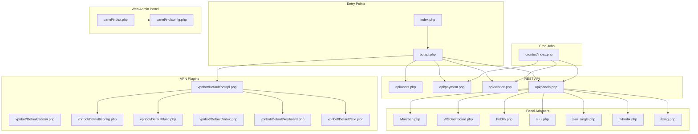
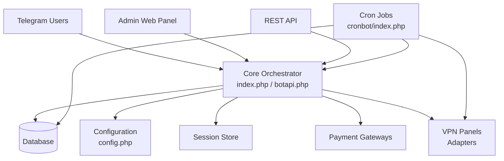
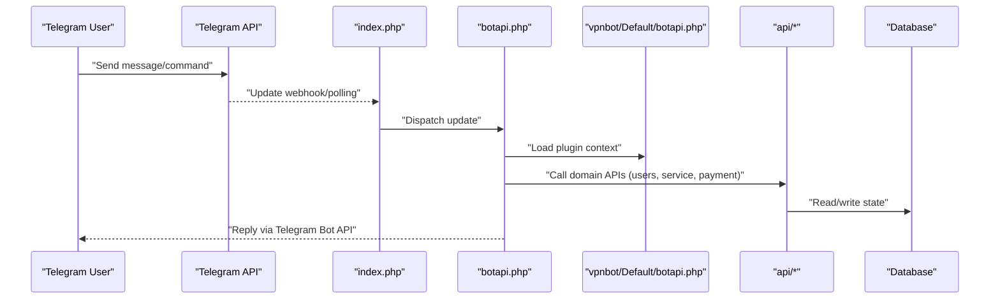
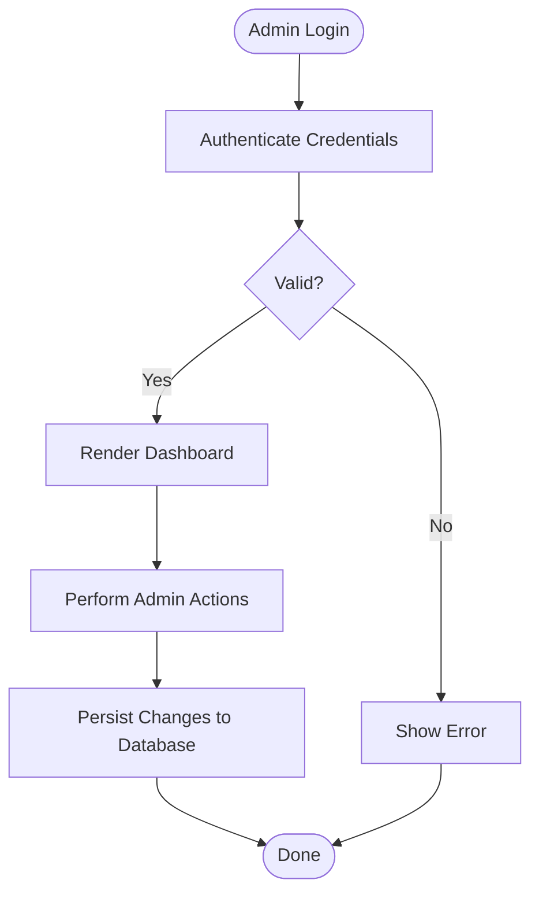
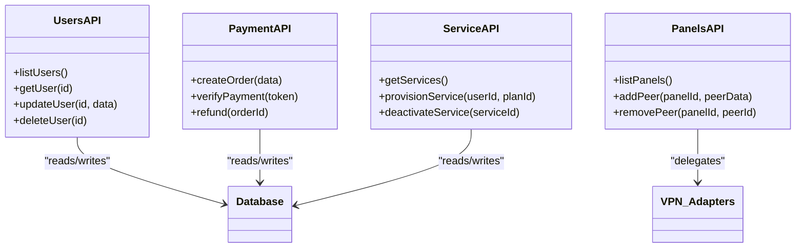
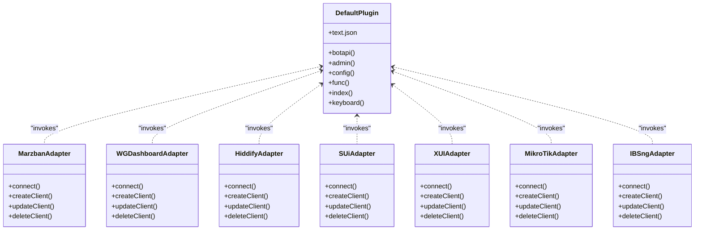
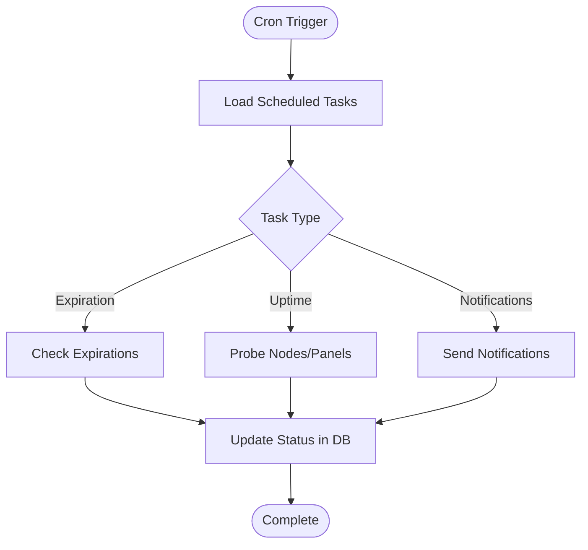
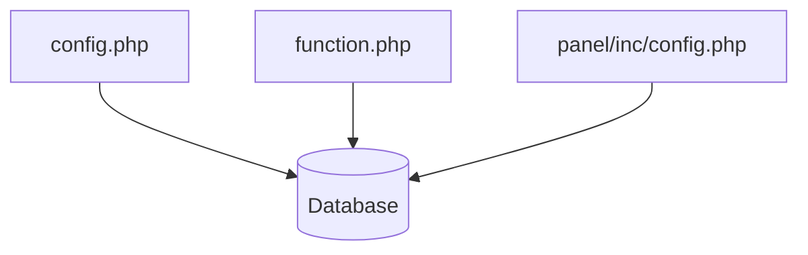
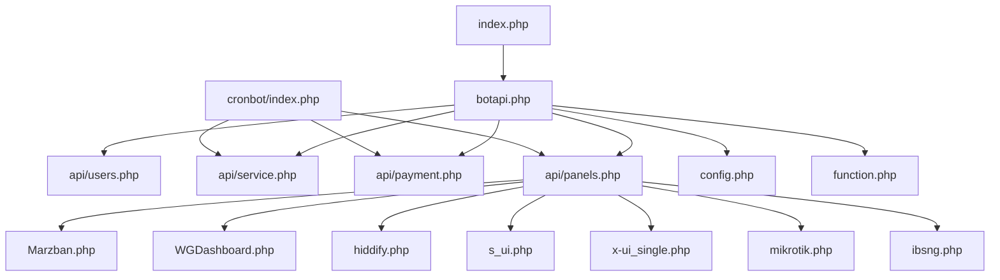
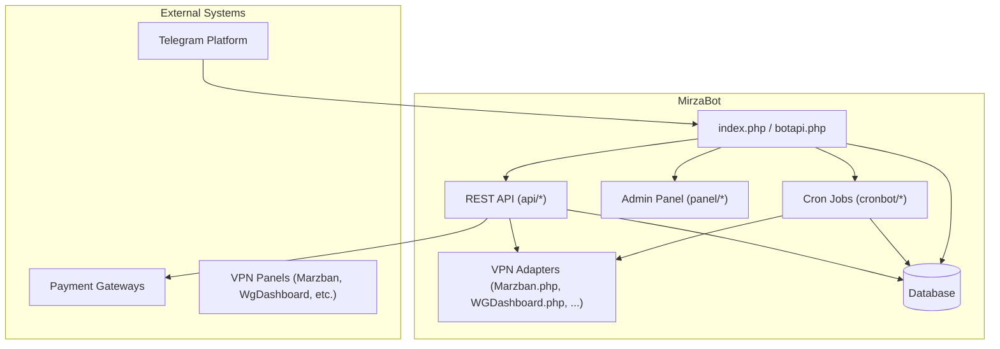

# Core Architecture

<cite>
**Referenced Files in This Document**
- [index.php](file://index.php)
- [botapi.php](file://botapi.php)
- [config.php](file://config.php)
- [function.php](file://function.php)
- [panels.php](file://panels.php)
- [request.php](file://request.php)
- [admin.php](file://admin.php)
- [panel/index.php](file://panel/index.php)
- [panel/inc/config.php](file://panel/inc/config.php)
- [api/users.php](file://api/users.php)
- [api/payment.php](file://api/payment.php)
- [api/service.php](file://api/service.php)
- [api/panels.php](file://api/panels.php)
- [cronbot/index.php](file://cronbot/index.php)
- [vpnbot/Default/botapi.php](file://vpnbot/Default/botapi.php)
- [vpnbot/Default/admin.php](file://vpnbot/Default/admin.php)
- [vpnbot/Default/config.php](file://vpnbot/Default/config.php)
- [vpnbot/Default/func.php](file://vpnbot/Default/func.php)
- [vpnbot/Default/index.php](file://vpnbot/Default/index.php)
- [vpnbot/Default/keyboard.php](file://vpnbot/Default/keyboard.php)
- [vpnbot/Default/text.json](file://vpnbot/Default/text.json)
- [Marzban.php](file://Marzban.php)
- [WGDashboard.php](file://WGDashboard.php)
- [hiddify.php](file://hiddify.php)
- [s_ui.php](file://s_ui.php)
- [x-ui_single.php](file://x-ui_single.php)
- [mikrotik.php](file://mikrotik.php)
- [ibsng.php](file://ibsng.php)
</cite>

## Table of Contents
1. [Introduction](#introduction)
2. [Project Structure](#project-structure)
3. [Core Components](#core-components)
4. [Architecture Overview](#architecture-overview)
5. [Detailed Component Analysis](#detailed-component-analysis)
6. [Dependency Analysis](#dependency-analysis)
7. [Performance Considerations](#performance-considerations)
8. [Troubleshooting Guide](#troubleshooting-guide)
9. [Conclusion](#conclusion)
10. [Appendices](#appendices)

## Introduction
This document describes MirzaBot’s core system architecture with a focus on its modular monolith structure, plugin-based VPN panel integration, and event-driven processing via cron jobs. It explains the main entry points (index.php, botapi.php), request routing flow, session management, and database abstraction layer. It also details the separation between the Telegram bot interface, web admin panel, and REST API layers, and maps interactions among user management, service provisioning, payment processing, and notification systems. Finally, it provides system context diagrams, scalability considerations, security boundaries, and extensibility points for custom integrations.

## Project Structure
MirzaBot is organized as a PHP-based modular monolith:
- Root-level entry points handle Telegram updates and general requests.
- The api/ directory exposes REST endpoints for internal and external consumers.
- The panel/ directory implements the web admin interface.
- The vpnbot/ directory contains pluggable VPN panel adapters.
- The cronbot/ directory hosts scheduled tasks and background workers.
- Payment gateways are implemented under payment/.
- Shared configuration and utilities reside at the root level.

**Diagram sources**
- [index.php:1-200](file://index.php#L1-L200)
- [botapi.php:1-200](file://botapi.php#L1-L200)
- [panel/index.php:1-200](file://panel/index.php#L1-L200)
- [panel/inc/config.php:1-200](file://panel/inc/config.php#L1-L200)
- [api/users.php:1-200](file://api/users.php#L1-L200)
- [api/payment.php:1-200](file://api/payment.php#L1-L200)
- [api/service.php:1-200](file://api/service.php#L1-L200)
- [api/panels.php:1-200](file://api/panels.php#L1-L200)
- [cronbot/index.php:1-200](file://cronbot/index.php#L1-L200)
- [vpnbot/Default/botapi.php:1-200](file://vpnbot/Default/botapi.php#L1-L200)
- [vpnbot/Default/admin.php:1-200](file://vpnbot/Default/admin.php#L1-L200)
- [vpnbot/Default/config.php:1-200](file://vpnbot/Default/config.php#L1-L200)
- [vpnbot/Default/func.php:1-200](file://vpnbot/Default/func.php#L1-L200)
- [vpnbot/Default/index.php:1-200](file://vpnbot/Default/index.php#L1-L200)
- [vpnbot/Default/keyboard.php:1-200](file://vpnbot/Default/keyboard.php#L1-L200)
- [vpnbot/Default/text.json:1-200](file://vpnbot/Default/text.json#L1-L200)
- [Marzban.php:1-200](file://Marzban.php#L1-L200)
- [WGDashboard.php:1-200](file://WGDashboard.php#L1-L200)
- [hiddify.php:1-200](file://hiddify.php#L1-L200)
- [s_ui.php:1-200](file://s_ui.php#L1-L200)
- [x-ui_single.php:1-200](file://x-ui_single.php#L1-L200)
- [mikrotik.php:1-200](file://mikrotik.php#L1-L200)
- [ibsng.php:1-200](file://ibsng.php#L1-L200)

**Section sources**
- [index.php:1-200](file://index.php#L1-L200)
- [botapi.php:1-200](file://botapi.php#L1-L200)
- [panel/index.php:1-200](file://panel/index.php#L1-L200)
- [panel/inc/config.php:1-200](file://panel/inc/config.php#L1-L200)
- [api/users.php:1-200](file://api/users.php#L1-L200)
- [api/payment.php:1-200](file://api/payment.php#L1-L200)
- [api/service.php:1-200](file://api/service.php#L1-L200)
- [api/panels.php:1-200](file://api/panels.php#L1-L200)
- [cronbot/index.php:1-200](file://cronbot/index.php#L1-L200)
- [vpnbot/Default/botapi.php:1-200](file://vpnbot/Default/botapi.php#L1-L200)
- [vpnbot/Default/admin.php:1-200](file://vpnbot/Default/admin.php#L1-L200)
- [vpnbot/Default/config.php:1-200](file://vpnbot/Default/config.php#L1-L200)
- [vpnbot/Default/func.php:1-200](file://vpnbot/Default/func.php#L1-L200)
- [vpnbot/Default/index.php:1-200](file://vpnbot/Default/index.php#L1-L200)
- [vpnbot/Default/keyboard.php:1-200](file://vpnbot/Default/keyboard.php#L1-L200)
- [vpnbot/Default/text.json:1-200](file://vpnbot/Default/text.json#L1-L200)
- [Marzban.php:1-200](file://Marzban.php#L1-L200)
- [WGDashboard.php:1-200](file://WGDashboard.php#L1-L200)
- [hiddify.php:1-200](file://hiddify.php#L1-L200)
- [s_ui.php:1-200](file://s_ui.php#L1-L200)
- [x-ui_single.php:1-200](file://x-ui_single.php#L1-L200)
- [mikrotik.php:1-200](file://mikrotik.php#L1-L200)
- [ibsng.php:1-200](file://ibsng.php#L1-L200)

## Core Components
- Telegram Bot Interface
  - Entry point index.php receives incoming updates and routes them to botapi.php for processing.
  - botapi.php orchestrates message handling, command dispatch, and interaction flows.
- Web Admin Panel
  - panel/index.php serves the admin UI; panel/inc/config.php centralizes panel configuration and shared includes.
  - Authentication and session management are handled within the panel scope.
- REST API Layer
  - api/users.php, api/payment.php, api/service.php, and api/panels.php expose structured endpoints for internal services and external clients.
- Cron Jobs and Background Processing
  - cronbot/index.php coordinates periodic tasks such as expiration checks, status monitoring, and notifications.
- VPN Plugin Architecture
  - vpnbot/Default/* provides a standard plugin contract for panel-specific logic (bot commands, admin actions, keyboard layouts, texts).
  - Root-level adapter files (e.g., Marzban.php, WGDashboard.php, hiddify.php, s_ui.php, x-ui_single.php, mikrotik.php, ibsng.php) implement protocol-specific integrations invoked by api/panels.php.

Key responsibilities:
- Request routing and orchestration: index.php, botapi.php
- Session and configuration management: panel/inc/config.php, config.php
- Domain operations: api/* modules
- Scheduled events: cronbot/*
- External integrations: vpnbot/* and adapter files

**Section sources**
- [index.php:1-200](file://index.php#L1-L200)
- [botapi.php:1-200](file://botapi.php#L1-L200)
- [panel/index.php:1-200](file://panel/index.php#L1-L200)
- [panel/inc/config.php:1-200](file://panel/inc/config.php#L1-L200)
- [api/users.php:1-200](file://api/users.php#L1-L200)
- [api/payment.php:1-200](file://api/payment.php#L1-L200)
- [api/service.php:1-200](file://api/service.php#L1-L200)
- [api/panels.php:1-200](file://api/panels.php#L1-L200)
- [cronbot/index.php:1-200](file://cronbot/index.php#L1-L200)
- [vpnbot/Default/botapi.php:1-200](file://vpnbot/Default/botapi.php#L1-L200)
- [vpnbot/Default/admin.php:1-200](file://vpnbot/Default/admin.php#L1-L200)
- [vpnbot/Default/config.php:1-200](file://vpnbot/Default/config.php#L1-L200)
- [vpnbot/Default/func.php:1-200](file://vpnbot/Default/func.php#L1-L200)
- [vpnbot/Default/index.php:1-200](file://vpnbot/Default/index.php#L1-L200)
- [vpnbot/Default/keyboard.php:1-200](file://vpnbot/Default/keyboard.php#L1-L200)
- [vpnbot/Default/text.json:1-200](file://vpnbot/Default/text.json#L1-L200)
- [Marzban.php:1-200](file://Marzban.php#L1-L200)
- [WGDashboard.php:1-200](file://WGDashboard.php#L1-L200)
- [hiddify.php:1-200](file://hiddify.php#L1-L200)
- [s_ui.php:1-200](file://s_ui.php#L1-L200)
- [x-ui_single.php:1-200](file://x-ui_single.php#L1-L200)
- [mikrotik.php:1-200](file://mikrotik.php#L1-L200)
- [ibsng.php:1-200](file://ibsng.php#L1-L200)

## Architecture Overview
The system follows a modular monolith design:
- Single deployment unit with clear module boundaries.
- Separation of concerns across interfaces (Telegram, Web Admin, REST API).
- Pluggable VPN panel adapters abstracting heterogeneous backend systems.
- Event-driven processing through cron jobs for asynchronous tasks.

**Diagram sources**
- [index.php:1-200](file://index.php#L1-L200)
- [botapi.php:1-200](file://botapi.php#L1-L200)
- [config.php:1-200](file://config.php#L1-L200)
- [api/users.php:1-200](file://api/users.php#L1-L200)
- [api/payment.php:1-200](file://api/payment.php#L1-L200)
- [api/service.php:1-200](file://api/service.php#L1-L200)
- [api/panels.php:1-200](file://api/panels.php#L1-L200)
- [cronbot/index.php:1-200](file://cronbot/index.php#L1-L200)
- [Marzban.php:1-200](file://Marzban.php#L1-L200)
- [WGDashboard.php:1-200](file://WGDashboard.php#L1-L200)
- [hiddify.php:1-200](file://hiddify.php#L1-L200)
- [s_ui.php:1-200](file://s_ui.php#L1-L200)
- [x-ui_single.php:1-200](file://x-ui_single.php#L1-L200)
- [mikrotik.php:1-200](file://mikrotik.php#L1-L200)
- [ibsng.php:1-200](file://ibsng.php#L1-L200)

## Detailed Component Analysis

### Telegram Bot Interface
- index.php receives updates from Telegram and forwards them to botapi.php.
- botapi.php parses payloads, validates tokens, resolves commands, and delegates to domain handlers.
- Keyboard and text resources are provided by the Default plugin set for consistent UX.

**Diagram sources**
- [index.php:1-200](file://index.php#L1-L200)
- [botapi.php:1-200](file://botapi.php#L1-L200)
- [vpnbot/Default/botapi.php:1-200](file://vpnbot/Default/botapi.php#L1-L200)
- [api/users.php:1-200](file://api/users.php#L1-L200)
- [api/service.php:1-200](file://api/service.php#L1-L200)
- [api/payment.php:1-200](file://api/payment.php#L1-L200)

**Section sources**
- [index.php:1-200](file://index.php#L1-L200)
- [botapi.php:1-200](file://botapi.php#L1-L200)
- [vpnbot/Default/botapi.php:1-200](file://vpnbot/Default/botapi.php#L1-L200)
- [vpnbot/Default/keyboard.php:1-200](file://vpnbot/Default/keyboard.php#L1-L200)
- [vpnbot/Default/text.json:1-200](file://vpnbot/Default/text.json#L1-L200)

### Web Admin Panel
- panel/index.php renders the admin UI and routes administrative actions.
- panel/inc/config.php centralizes configuration, layout includes, and shared helpers.
- Authentication and session management are scoped to the panel namespace.

**Diagram sources**
- [panel/index.php:1-200](file://panel/index.php#L1-L200)
- [panel/inc/config.php:1-200](file://panel/inc/config.php#L1-L200)

**Section sources**
- [panel/index.php:1-200](file://panel/index.php#L1-L200)
- [panel/inc/config.php:1-200](file://panel/inc/config.php#L1-L200)

### REST API Layer
- api/users.php manages user lifecycle and profile data.
- api/payment.php handles payment initiation, verification, and callbacks.
- api/service.php provisions and manages services.
- api/panels.php orchestrates calls to VPN panel adapters.

**Diagram sources**
- [api/users.php:1-200](file://api/users.php#L1-L200)
- [api/payment.php:1-200](file://api/payment.php#L1-L200)
- [api/service.php:1-200](file://api/service.php#L1-L200)
- [api/panels.php:1-200](file://api/panels.php#L1-L200)

**Section sources**
- [api/users.php:1-200](file://api/users.php#L1-L200)
- [api/payment.php:1-200](file://api/payment.php#L1-L200)
- [api/service.php:1-200](file://api/service.php#L1-L200)
- [api/panels.php:1-200](file://api/panels.php#L1-L200)

### VPN Plugin Architecture
- The Default plugin set defines a common contract for bot commands, admin actions, keyboard layouts, and localized texts.
- Root-level adapter files implement specific protocols for each VPN panel provider.

**Diagram sources**
- [vpnbot/Default/botapi.php:1-200](file://vpnbot/Default/botapi.php#L1-L200)
- [vpnbot/Default/admin.php:1-200](file://vpnbot/Default/admin.php#L1-L200)
- [vpnbot/Default/config.php:1-200](file://vpnbot/Default/config.php#L1-L200)
- [vpnbot/Default/func.php:1-200](file://vpnbot/Default/func.php#L1-L200)
- [vpnbot/Default/index.php:1-200](file://vpnbot/Default/index.php#L1-L200)
- [vpnbot/Default/keyboard.php:1-200](file://vpnbot/Default/keyboard.php#L1-L200)
- [vpnbot/Default/text.json:1-200](file://vpnbot/Default/text.json#L1-L200)
- [Marzban.php:1-200](file://Marzban.php#L1-L200)
- [WGDashboard.php:1-200](file://WGDashboard.php#L1-L200)
- [hiddify.php:1-200](file://hiddify.php#L1-L200)
- [s_ui.php:1-200](file://s_ui.php#L1-L200)
- [x-ui_single.php:1-200](file://x-ui_single.php#L1-L200)
- [mikrotik.php:1-200](file://mikrotik.php#L1-L200)
- [ibsng.php:1-200](file://ibsng.php#L1-L200)

**Section sources**
- [vpnbot/Default/botapi.php:1-200](file://vpnbot/Default/botapi.php#L1-L200)
- [vpnbot/Default/admin.php:1-200](file://vpnbot/Default/admin.php#L1-L200)
- [vpnbot/Default/config.php:1-200](file://vpnbot/Default/config.php#L1-L200)
- [vpnbot/Default/func.php:1-200](file://vpnbot/Default/func.php#L1-L200)
- [vpnbot/Default/index.php:1-200](file://vpnbot/Default/index.php#L1-L200)
- [vpnbot/Default/keyboard.php:1-200](file://vpnbot/Default/keyboard.php#L1-L200)
- [vpnbot/Default/text.json:1-200](file://vpnbot/Default/text.json#L1-L200)
- [Marzban.php:1-200](file://Marzban.php#L1-L200)
- [WGDashboard.php:1-200](file://WGDashboard.php#L1-L200)
- [hiddify.php:1-200](file://hiddify.php#L1-L200)
- [s_ui.php:1-200](file://s_ui.php#L1-L200)
- [x-ui_single.php:1-200](file://x-ui_single.php#L1-L200)
- [mikrotik.php:1-200](file://mikrotik.php#L1-L200)
- [ibsng.php:1-200](file://ibsng.php#L1-L200)

### Cron Jobs and Event-Driven Processing
- cronbot/index.php schedules recurring tasks such as expiration checks, uptime monitoring, and notifications.
- It interacts with the database and invokes panel adapters to reconcile state.

**Diagram sources**
- [cronbot/index.php:1-200](file://cronbot/index.php#L1-L200)

**Section sources**
- [cronbot/index.php:1-200](file://cronbot/index.php#L1-L200)

### Configuration and Database Abstraction
- config.php centralizes application-wide settings and environment variables.
- function.php provides shared utilities used across modules.
- The panel configuration panel/inc/config.php isolates admin panel settings and includes.

**Diagram sources**
- [config.php:1-200](file://config.php#L1-L200)
- [function.php:1-200](file://function.php#L1-L200)
- [panel/inc/config.php:1-200](file://panel/inc/config.php#L1-L200)

**Section sources**
- [config.php:1-200](file://config.php#L1-L200)
- [function.php:1-200](file://function.php#L1-L200)
- [panel/inc/config.php:1-200](file://panel/inc/config.php#L1-L200)

## Dependency Analysis
High-level dependencies:
- index.php and botapi.php depend on configuration and utility modules.
- API modules depend on database access and VPN adapters.
- Cron jobs depend on API modules and adapters for reconciliation.
- VPN adapters encapsulate external panel SDKs or HTTP APIs.

**Diagram sources**
- [index.php:1-200](file://index.php#L1-L200)
- [botapi.php:1-200](file://botapi.php#L1-L200)
- [api/users.php:1-200](file://api/users.php#L1-L200)
- [api/service.php:1-200](file://api/service.php#L1-L200)
- [api/payment.php:1-200](file://api/payment.php#L1-L200)
- [api/panels.php:1-200](file://api/panels.php#L1-L200)
- [cronbot/index.php:1-200](file://cronbot/index.php#L1-L200)
- [config.php:1-200](file://config.php#L1-L200)
- [function.php:1-200](file://function.php#L1-L200)
- [Marzban.php:1-200](file://Marzban.php#L1-L200)
- [WGDashboard.php:1-200](file://WGDashboard.php#L1-L200)
- [hiddify.php:1-200](file://hiddify.php#L1-L200)
- [s_ui.php:1-200](file://s_ui.php#L1-L200)
- [x-ui_single.php:1-200](file://x-ui_single.php#L1-L200)
- [mikrotik.php:1-200](file://mikrotik.php#L1-L200)
- [ibsng.php:1-200](file://ibsng.php#L1-L200)

**Section sources**
- [index.php:1-200](file://index.php#L1-L200)
- [botapi.php:1-200](file://botapi.php#L1-L200)
- [api/users.php:1-200](file://api/users.php#L1-L200)
- [api/service.php:1-200](file://api/service.php#L1-L200)
- [api/payment.php:1-200](file://api/payment.php#L1-L200)
- [api/panels.php:1-200](file://api/panels.php#L1-L200)
- [cronbot/index.php:1-200](file://cronbot/index.php#L1-L200)
- [config.php:1-200](file://config.php#L1-L200)
- [function.php:1-200](file://function.php#L1-L200)
- [Marzban.php:1-200](file://Marzban.php#L1-L200)
- [WGDashboard.php:1-200](file://WGDashboard.php#L1-L200)
- [hiddify.php:1-200](file://hiddify.php#L1-L200)
- [s_ui.php:1-200](file://s_ui.php#L1-L200)
- [x-ui_single.php:1-200](file://x-ui_single.php#L1-L200)
- [mikrotik.php:1-200](file://mikrotik.php#L1-L200)
- [ibsng.php:1-200](file://ibsng.php#L1-L200)

## Performance Considerations
- Use connection pooling for database access to reduce overhead under high concurrency.
- Cache frequently accessed configuration and static resources where safe.
- Offload long-running operations (e.g., bulk provisioning) to background workers triggered by cronbot.
- Implement rate limiting and request validation at the API boundary to protect downstream adapters.
- Prefer batch operations when interacting with VPN panels to minimize network round-trips.

[No sources needed since this section provides general guidance]

## Troubleshooting Guide
Common areas to inspect:
- Telegram update delivery and token validation in index.php and botapi.php.
- API error responses and payload structures in api/*.
- VPN adapter connectivity and authentication in adapter files.
- Cron job execution logs and scheduling in cronbot/index.php.
- Panel configuration and session state in panel/inc/config.php.

Recommended steps:
- Verify webhook/polling configuration and bot token validity.
- Check database connectivity and query performance.
- Validate VPN panel credentials and endpoint reachability.
- Review cron logs for failed tasks and retry policies.
- Inspect admin panel sessions and permissions.

**Section sources**
- [index.php:1-200](file://index.php#L1-L200)
- [botapi.php:1-200](file://botapi.php#L1-L200)
- [api/users.php:1-200](file://api/users.php#L1-L200)
- [api/payment.php:1-200](file://api/payment.php#L1-L200)
- [api/service.php:1-200](file://api/service.php#L1-L200)
- [api/panels.php:1-200](file://api/panels.php#L1-L200)
- [cronbot/index.php:1-200](file://cronbot/index.php#L1-L200)
- [panel/inc/config.php:1-200](file://panel/inc/config.php#L1-L200)

## Conclusion
MirzaBot’s architecture combines a modular monolith with clear separation of concerns across Telegram, web admin, and REST API layers. The plugin-based VPN panel integration enables flexible support for multiple providers, while cron-driven tasks ensure reliable background processing. With proper configuration, caching, and robust error handling, the system can scale horizontally at the application layer and integrate additional panels and payment gateways through well-defined extension points.

[No sources needed since this section summarizes without analyzing specific files]

## Appendices

### System Context Diagram

**Diagram sources**
- [index.php:1-200](file://index.php#L1-L200)
- [botapi.php:1-200](file://botapi.php#L1-L200)
- [api/users.php:1-200](file://api/users.php#L1-L200)
- [api/payment.php:1-200](file://api/payment.php#L1-L200)
- [api/service.php:1-200](file://api/service.php#L1-L200)
- [api/panels.php:1-200](file://api/panels.php#L1-L200)
- [cronbot/index.php:1-200](file://cronbot/index.php#L1-L200)
- [panel/index.php:1-200](file://panel/index.php#L1-L200)
- [Marzban.php:1-200](file://Marzban.php#L1-L200)
- [WGDashboard.php:1-200](file://WGDashboard.php#L1-L200)
- [hiddify.php:1-200](file://hiddify.php#L1-L200)
- [s_ui.php:1-200](file://s_ui.php#L1-L200)
- [x-ui_single.php:1-200](file://x-ui_single.php#L1-L200)
- [mikrotik.php:1-200](file://mikrotik.php#L1-L200)
- [ibsng.php:1-200](file://ibsng.php#L1-L200)