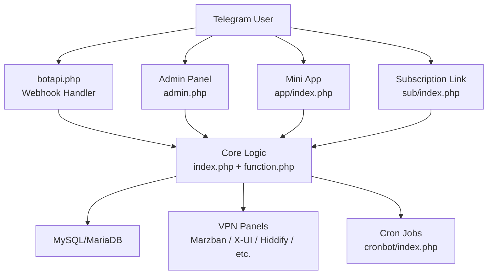
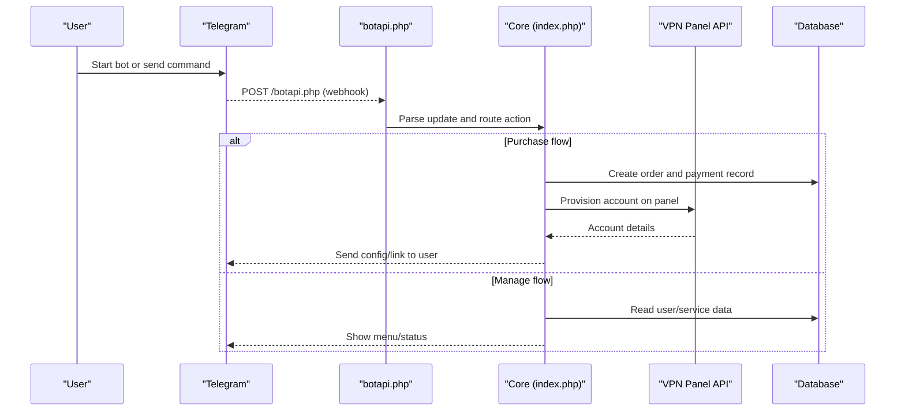
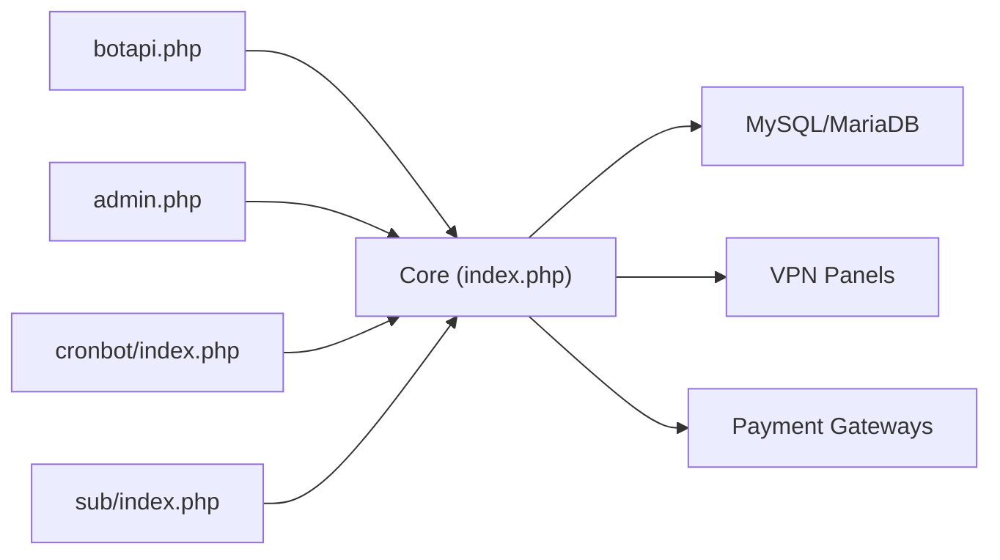

# Getting Started

<cite>
**Referenced Files in This Document**
- [README.md](file://README.md)
- [install.sh](file://install.sh)
- [config.php](file://config.php)
- [index.php](file://index.php)
- [botapi.php](file://botapi.php)
- [admin.php](file://admin.php)
- [panel/inc/config.php](file://panel/inc/config.php)
- [cronbot/index.php](file://cronbot/index.php)
- [sub/index.php](file://sub/index.php)
</cite>

## Table of Contents
1. Introduction
2. Project Structure
3. Core Components
4. Architecture Overview
5. Detailed Component Analysis
6. Dependency Analysis
7. Performance Considerations
8. Troubleshooting Guide
9. Conclusion

## Introduction
MirzaBot is a full-stack Telegram bot platform for VPN service management. It combines:
- A PHP backend that handles Telegram webhook processing, admin panel logic, and integrations with multiple VPN panels
- A Vue.js-based frontend served from the app directory for the client-facing mini-app experience
- Deep integration with the Telegram Bot API to deliver interactive menus, payments, and user management via Telegram

This guide helps you install MirzaBot, configure it, deploy your first bot, and connect a VPN panel. It also includes troubleshooting tips for common setup issues.

## Project Structure
At a high level, MirzaBot exposes several web entry points:
- index.php: Main application entry point
- botapi.php: Telegram webhook handler
- admin.php: Admin panel entry point
- panel/inc/config.php: Admin panel configuration
- cronbot/index.php: Scheduled tasks and background jobs
- sub/index.php: Subscription link endpoint
- app/: Compiled Vue.js assets and mini-app entry
- api/: REST endpoints used by the frontend and mini-app
- vpnbot/: Plugin-style modules for different VPN backends

**Diagram sources**
- [index.php](file://index.php)
- [botapi.php](file://botapi.php)
- [admin.php](file://admin.php)
- [panel/inc/config.php](file://panel/inc/config.php)
- [cronbot/index.php](file://cronbot/index.php)
- [sub/index.php](file://sub/index.php)

**Section sources**
- [README.md](file://README.md)

## Core Components
- Telegram Webhook Handler: Receives updates from Telegram and routes them to core logic.
- Admin Panel: Web UI for managing users, services, payments, and settings.
- Mini App (Vue.js): In-Telegram client interface for browsing services and purchasing subscriptions.
- Subscription Endpoint: Serves subscription files/links based on user tokens.
- Cron Tasks: Background jobs for expiration checks, notifications, and maintenance.
- VPN Integrations: Adapters for Marzban, X-UI, Hiddify, IBSng, and others.

Key responsibilities:
- Authentication and authorization for admin and users
- Service catalog and order lifecycle
- Payment gateway integration
- Panel operations (create/update/disable accounts)
- Logging and statistics

**Section sources**
- [botapi.php](file://botapi.php)
- [admin.php](file://admin.php)
- [panel/inc/config.php](file://panel/inc/config.php)
- [cronbot/index.php](file://cronbot/index.php)
- [sub/index.php](file://sub/index.php)
- [index.php](file://index.php)

## Architecture Overview
The system follows a modular architecture:
- Frontend: Vue.js mini-app under app/
- Backend: PHP controllers and utilities
- Data: MySQL/MariaDB
- External APIs: Telegram Bot API and VPN panel APIs

**Diagram sources**
- [botapi.php](file://botapi.php)
- [index.php](file://index.php)
- [sub/index.php](file://sub/index.php)

## Detailed Component Analysis

### System Requirements
- PHP 7.4+ with extensions: cURL, JSON, PDO (MySQL), OpenSSL, mbstring, GD (optional), ZipArchive (optional)
- MySQL or MariaDB database server
- Web server: Apache or Nginx with PHP-FPM
- Publicly accessible HTTPS URL for Telegram webhook
- Telegram Bot Token from @BotFather

Notes:
- Ensure your server can reach external APIs (Telegram and VPN panels).
- For Nginx/Apache, ensure rewrite rules are enabled and PHP is configured to handle .php requests.

**Section sources**
- [README.md](file://README.md)

### Installation Steps
1. Prepare the environment
   - Install PHP 7.4+, MySQL/MariaDB, and a web server (Apache/Nginx).
   - Enable required PHP extensions (cURL, PDO_MySQL, JSON, OpenSSL, mbstring).
   - Create a new MySQL database and user.

2. Deploy MirzaBot
   - Clone or upload the repository to your web root.
   - Set correct file permissions for writable directories (logs, cache if any).

3. Run the installer
   - Execute the provided installation script:
     - Command: ./install.sh
   - The script will:
     - Validate prerequisites
     - Prompt for database credentials
     - Generate or update configuration files
     - Initialize database schema
     - Set up basic defaults

4. Configure the application
   - Edit the main configuration file:
     - File: config.php
     - Set database connection, Telegram Bot Token, site URL, and other options.
   - Configure the admin panel:
     - File: panel/inc/config.php
     - Set admin credentials and panel-specific settings.

5. Set up the Telegram webhook
   - Use the admin panel or CLI to register the webhook URL pointing to your server’s botapi.php.
   - Ensure HTTPS is enabled and reachable from the internet.

6. Start background jobs
   - Add cron entries to run cronbot/index.php at regular intervals (e.g., every minute).
   - Example schedule: * * * * * php /path/to/cronbot/index.php

7. Verify the deployment
   - Visit the admin panel URL and log in.
   - Start a conversation with your bot on Telegram and test basic commands.

**Section sources**
- [install.sh](file://install.sh)
- [config.php](file://config.php)
- [panel/inc/config.php](file://panel/inc/config.php)
- [botapi.php](file://botapi.php)
- [cronbot/index.php](file://cronbot/index.php)

### Initial Configuration
- Database: Host, port, username, password, database name
- Telegram: Bot token, webhook URL, allowed chat IDs for admin
- Site: Base URL, timezone, language, logging levels
- Payments: Gateway keys and callbacks
- VPN Panels: API endpoints, tokens, and node mappings

Where to edit:
- Main app configuration: config.php
- Admin panel configuration: panel/inc/config.php

After editing, clear caches if applicable and reload the admin panel.

**Section sources**
- [config.php](file://config.php)
- [panel/inc/config.php](file://panel/inc/config.php)

### First Bot Deployment
- Register a new bot with @BotFather and obtain the token.
- Update config.php with the token and set the webhook URL to https://yourdomain.com/botapi.php.
- Use the admin panel to enable the webhook and verify connectivity.
- Test by sending /start to your bot.

If using a reverse proxy (Nginx/Apache), ensure:
- Requests to /botapi.php are forwarded to PHP
- No extra trailing slashes or path rewriting breaks the payload

**Section sources**
- [botapi.php](file://botapi.php)
- [config.php](file://config.php)

### Admin Panel Access
- Access the admin panel at https://yourdomain.com/admin.php
- Log in with the default or configured admin credentials
- From Settings, configure:
  - General settings (site info, timezone, language)
  - Telegram bot settings (token, webhook, admin chats)
  - Payment gateways
  - VPN panel integrations

Security recommendations:
- Restrict admin access by IP if possible
- Change default passwords immediately
- Keep the admin URL non-guessable if supported

**Section sources**
- [admin.php](file://admin.php)
- [panel/inc/config.php](file://panel/inc/config.php)

### First VPN Panel Integration
Supported panels include Marzban, X-UI, Hiddify, IBSng, and more. To integrate:
- Obtain the panel API endpoint and authentication token
- In the admin panel, add a new panel and enter:
  - Panel type
  - API base URL
  - Auth token or credentials
  - Node/server mapping if applicable
- Save and test the connection
- Create a service linked to the panel and publish it in the bot

For programmatic setup, refer to the panel adapter files and the admin panel’s panel management pages.

**Section sources**
- [admin.php](file://admin.php)
- [Marzban.php](file://Marzban.php)
- [WGDashboard.php](file://WGDashboard.php)
- [hiddify.php](file://hiddify.php)
- [s_ui.php](file://s_ui.php)
- [ibsng.php](file://ibsng.php)

### Basic Usage Examples
- Start the bot: Open Telegram and message your bot with /start
- Browse services: Use the inline menu to view available plans
- Purchase a plan: Follow the payment flow and receive configuration details
- Manage subscriptions: Renew, extend, or delete via the bot menu
- View subscription links: Use the subscription endpoint to retrieve configs

Subscription link example:
- https://yourdomain.com/sub/?token=USER_TOKEN

**Section sources**
- [sub/index.php](file://sub/index.php)
- [botapi.php](file://botapi.php)

## Dependency Analysis
External dependencies:
- Telegram Bot API: Webhook delivery and messaging
- MySQL/MariaDB: Persistent storage for users, orders, logs
- VPN Panel APIs: Provisioning and account management
- Optional: Payment gateways (Zarinpal, IranPay, NowPayments, etc.)

Internal module relationships:
- botapi.php depends on core logic and database
- admin.php provides UI over shared business logic
- cronbot/index.php runs periodic tasks against the database and panels
- sub/index.php serves subscription content based on tokens

**Diagram sources**
- [botapi.php](file://botapi.php)
- [index.php](file://index.php)
- [admin.php](file://admin.php)
- [cronbot/index.php](file://cronbot/index.php)
- [sub/index.php](file://sub/index.php)

**Section sources**
- [botapi.php](file://botapi.php)
- [index.php](file://index.php)
- [admin.php](file://admin.php)
- [cronbot/index.php](file://cronbot/index.php)
- [sub/index.php](file://sub/index.php)

## Performance Considerations
- Use PHP OPcache and enable opcode caching
- Tune MySQL query cache and connection limits
- Offload heavy tasks to cron and queue workers where possible
- Cache static assets and use CDN for media
- Monitor webhook latency and scale horizontally behind a load balancer if needed

[No sources needed since this section provides general guidance]

## Troubleshooting Guide
Common issues and resolutions:
- Webhook not receiving updates
  - Verify HTTPS certificate and domain resolution
  - Confirm the webhook URL points to botapi.php
  - Check server firewall and reverse proxy rules
- Database connection errors
  - Validate credentials in config.php and panel/inc/config.php
  - Ensure the database user has proper privileges
- Admin panel login failures
  - Reset admin credentials via the fix_admin utility if available
  - Clear browser cache and cookies
- VPN panel connection failures
  - Test API endpoint reachability and credentials
  - Review SSL/TLS settings and certificates
- Cron jobs not running
  - Verify crontab entries and paths
  - Check execution permissions and error logs

Useful diagnostics:
- Logs: Review application logs and server error logs
- Connectivity tests: Use provided scripts to check DNS, ports, and panel reachability
- Environment checks: Re-run install.sh to validate prerequisites

**Section sources**
- [install.sh](file://install.sh)
- [config.php](file://config.php)
- [panel/inc/config.php](file://panel/inc/config.php)
- [botapi.php](file://botapi.php)
- [admin.php](file://admin.php)

## Conclusion
You now have the essentials to install, configure, and operate MirzaBot. Start with the installer, secure your admin panel, connect your Telegram bot, and integrate your first VPN panel. Refer to the troubleshooting section if you encounter issues, and consult the admin panel documentation for advanced features like payments, affiliates, and multi-panel management.

[No sources needed since this section summarizes without analyzing specific files]