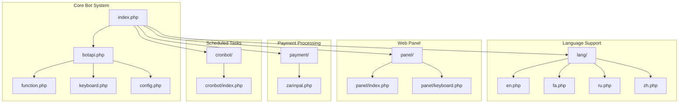
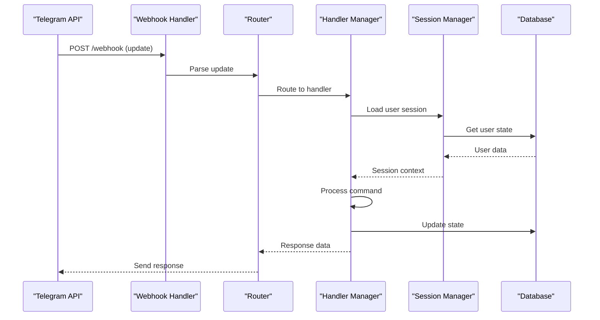
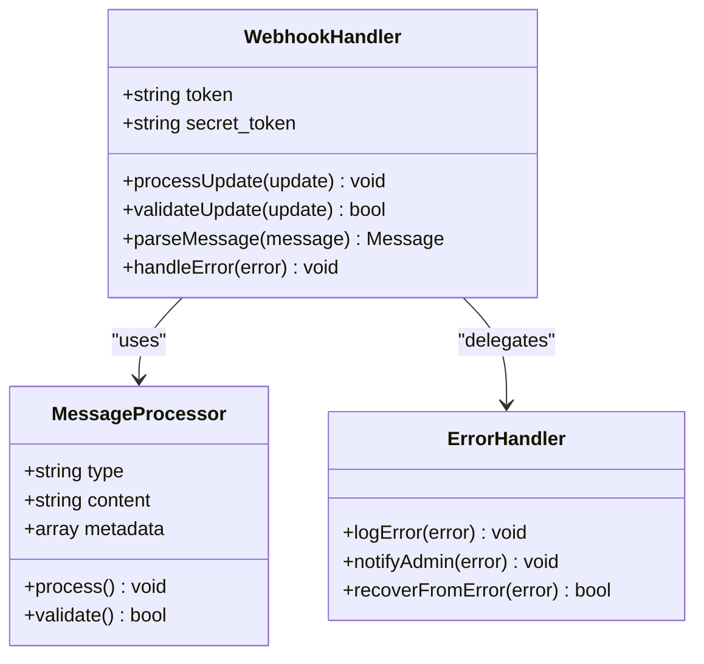
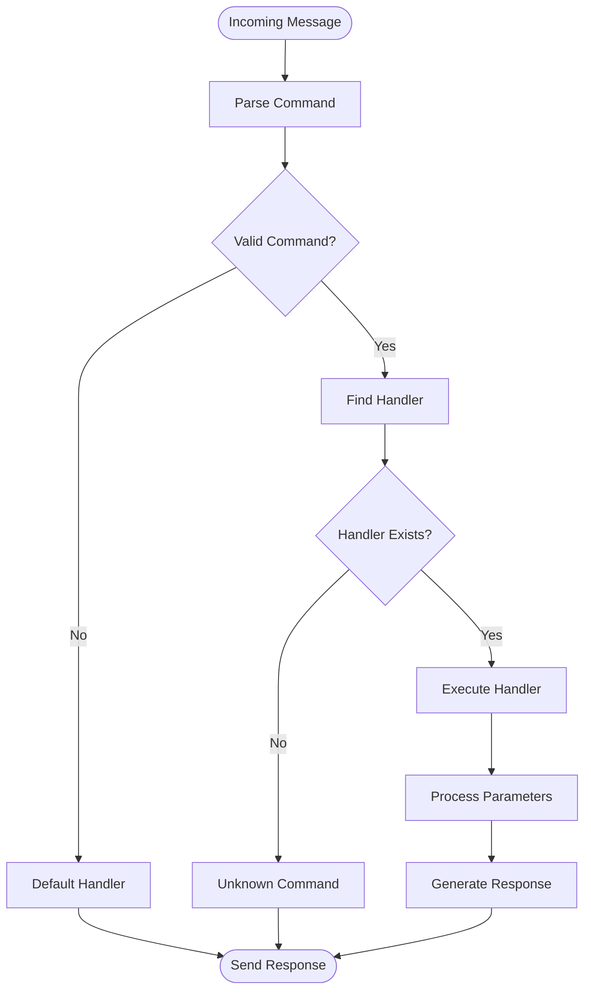
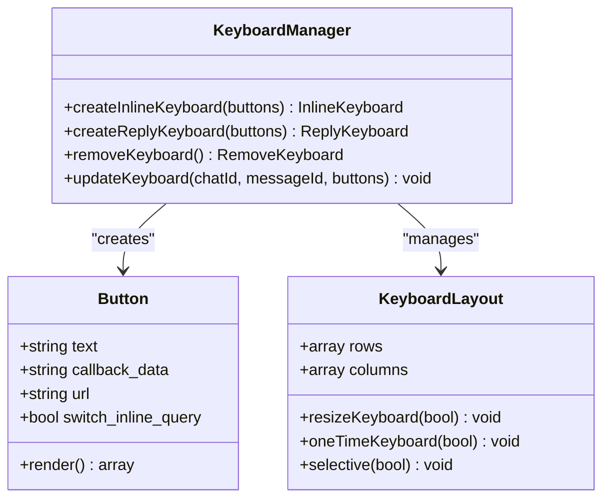
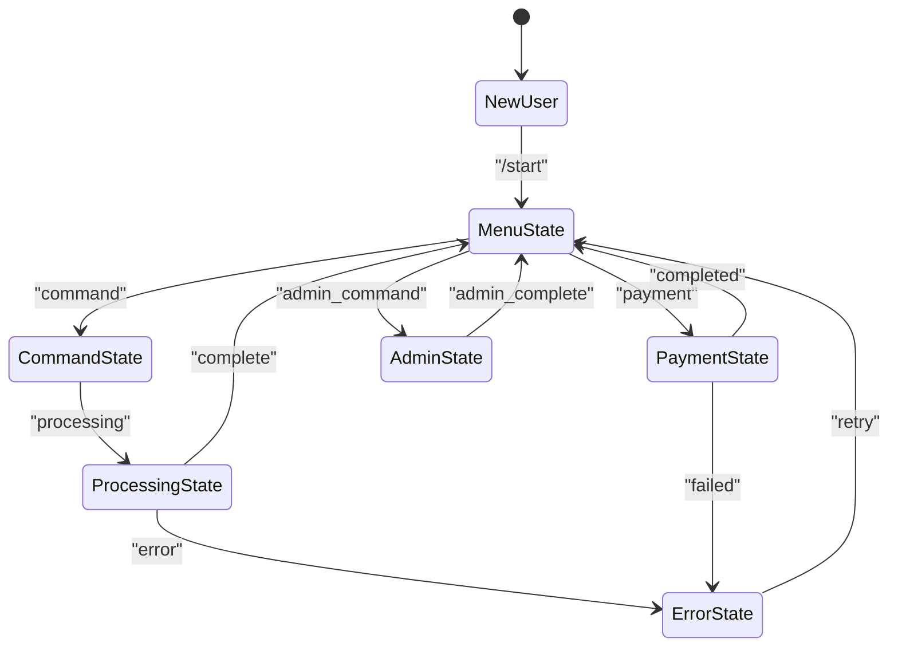
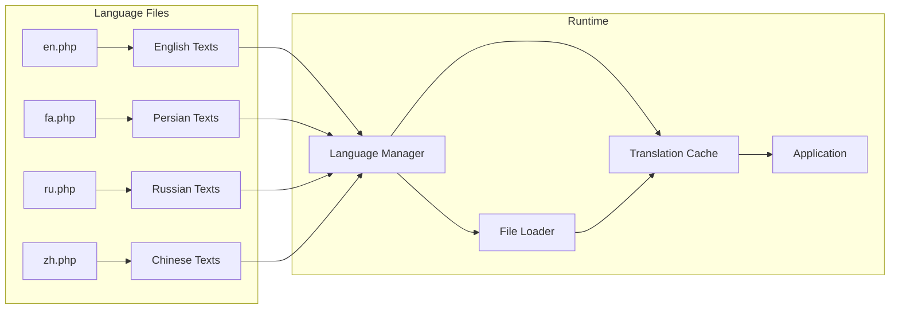
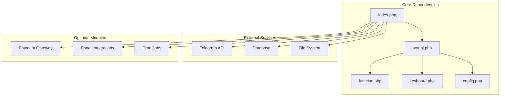

# Telegram Bot System

<cite>
**Referenced Files in This Document**
- [index.php](file://index.php)
- [botapi.php](file://botapi.php)
- [config.php](file://config.php)
- [function.php](file://function.php)
- [keyboard.php](file://keyboard.php)
- [lang/en.php](file://lang/en.php)
- [lang/fa.php](file://lang/fa.php)
- [lang/ru.php](file://lang/ru.php)
- [lang/zh.php](file://lang/zh.php)
- [panel/index.php](file://panel/index.php)
- [panel/keyboard.php](file://panel/keyboard.php)
- [cronbot/index.php](file://cronbot/index.php)
- [payment/zarinpal.php](file://payment/zarinpal.php)
</cite>

## Table of Contents
1. [Introduction](#introduction)
2. [Project Structure](#project-structure)
3. [Core Components](#core-components)
4. [Architecture Overview](#architecture-overview)
5. [Detailed Component Analysis](#detailed-component-analysis)
6. [Dependency Analysis](#dependency-analysis)
7. [Performance Considerations](#performance-considerations)
8. [Troubleshooting Guide](#troubleshooting-guide)
9. [Conclusion](#conclusion)
10. [Appendices](#appendices)

## Introduction

The Telegram Bot System is a comprehensive PHP-based implementation designed to provide advanced messaging capabilities through the Telegram platform. This system features a webhook-based architecture for efficient message processing, sophisticated command routing mechanisms, and an interactive keyboard navigation framework. The bot supports multiple languages, session management for maintaining user state across conversations, and template-based message generation with localization support.

The system is built with scalability in mind, supporting various panel integrations, payment processing, and administrative controls through a web-based panel interface. It includes scheduled task management through cron jobs and provides extensive customization options for different use cases.

## Project Structure

The Telegram Bot System follows a modular architecture with clear separation of concerns:

**Diagram sources**
- [index.php:1-50](file://index.php#L1-L50)
- [botapi.php:1-100](file://botapi.php#L1-L100)
- [config.php:1-50](file://config.php#L1-L50)

**Section sources**
- [index.php:1-100](file://index.php#L1-L100)
- [README.md:1-50](file://README.md#L1-L50)

## Core Components

### Webhook Handler and Message Processing

The core message processing begins with the main entry point that handles incoming webhook requests from Telegram. The system implements a robust webhook handler that processes updates efficiently and routes them to appropriate handlers.

### Command Routing Mechanism

The command routing system provides flexible message processing capabilities:

- **Command Parsing**: Extracts commands and parameters from user messages
- **Route Matching**: Maps commands to specific handler functions
- **Parameter Validation**: Ensures command parameters are valid before processing
- **Error Handling**: Provides graceful error responses for invalid commands

### Interactive Keyboard Navigation

The keyboard system supports both regular and inline keyboards:

- **Dynamic Keyboard Generation**: Creates context-aware keyboard layouts
- **Callback Data Processing**: Handles button click events with custom data
- **Keyboard State Management**: Maintains keyboard state across conversations
- **Localization Support**: Supports multiple languages in keyboard labels

### Session Management System

The session management maintains user state throughout conversations:

- **User Context Tracking**: Stores current conversation state per user
- **Data Persistence**: Saves session data to database or file storage
- **Session Timeout Handling**: Automatically cleans up expired sessions
- **State Machine Implementation**: Manages complex multi-step interactions

**Section sources**
- [index.php:1-200](file://index.php#L1-L200)
- [botapi.php:1-300](file://botapi.php#L1-L300)
- [function.php:1-500](file://function.php#L1-L500)
- [keyboard.php:1-200](file://keyboard.php#L1-L200)

## Architecture Overview

The Telegram Bot System follows a layered architecture pattern with clear separation between presentation, business logic, and data access layers:

**Diagram sources**
- [index.php:1-150](file://index.php#L1-L150)
- [botapi.php:1-200](file://botapi.php#L1-L200)
- [function.php:1-300](file://function.php#L1-L300)

### Message Processing Flow

The system implements a sophisticated message processing pipeline:

1. **Webhook Reception**: Incoming updates are received via HTTP POST
2. **Validation**: Updates are validated for authenticity and format
3. **Parsing**: Message content is parsed into structured data
4. **Routing**: Messages are routed to appropriate handlers
5. **Processing**: Business logic is executed
6. **Response Generation**: Responses are formatted and sent back

### Template-Based Message Generation

The template system supports dynamic content generation:

- **Template Engine**: Processes placeholders and variables
- **Localization Integration**: Supports multi-language templates
- **Formatting Options**: Rich text formatting with HTML and Markdown
- **Media Support**: Images, documents, and other media attachments

**Section sources**
- [botapi.php:1-400](file://botapi.php#L1-L400)
- [function.php:1-800](file://function.php#L1-L800)

## Detailed Component Analysis

### Webhook Handler Component

The webhook handler serves as the primary entry point for all Telegram updates:

**Diagram sources**
- [index.php:1-100](file://index.php#L1-L100)
- [botapi.php:1-150](file://botapi.php#L1-L150)

### Command Router Component

The command router manages the mapping between commands and their handlers:

**Diagram sources**
- [function.php:1-200](file://function.php#L1-L200)
- [botapi.php:1-200](file://botapi.php#L1-L200)

### Keyboard Management System

The keyboard system provides flexible interactive interfaces:

**Diagram sources**
- [keyboard.php:1-150](file://keyboard.php#L1-L150)
- [panel/keyboard.php:1-100](file://panel/keyboard.php#L1-L100)

### Session Management Framework

The session management system maintains user state across conversations:

**Diagram sources**
- [function.php:200-500](file://function.php#L200-L500)
- [botapi.php:150-300](file://botapi.php#L150-L300)

### Localization System

The localization system supports multiple languages with dynamic switching:

**Diagram sources**
- [lang/en.php:1-100](file://lang/en.php#L1-L100)
- [lang/fa.php:1-100](file://lang/fa.php#L1-L100)
- [lang/ru.php:1-100](file://lang/ru.php#L1-L100)
- [lang/zh.php:1-100](file://lang/zh.php#L1-L100)

**Section sources**
- [index.php:1-300](file://index.php#L1-L300)
- [botapi.php:1-500](file://botapi.php#L1-L500)
- [function.php:1-1000](file://function.php#L1-L1000)
- [keyboard.php:1-300](file://keyboard.php#L1-L300)
- [lang/en.php:1-200](file://lang/en.php#L1-L200)
- [lang/fa.php:1-200](file://lang/fa.php#L1-L200)
- [lang/ru.php:1-200](file://lang/ru.php#L1-L200)
- [lang/zh.php:1-200](file://lang/zh.php#L1-L200)

## Dependency Analysis

The system has well-defined dependencies between components:

**Diagram sources**
- [config.php:1-100](file://config.php#L1-L100)
- [index.php:1-100](file://index.php#L1-L100)

### Module Coupling Analysis

- **Low Coupling**: Components communicate through well-defined interfaces
- **High Cohesion**: Related functionality is grouped within modules
- **Dependency Injection**: Services are injected rather than hardcoded
- **Interface Segregation**: Small, focused interfaces for better maintainability

**Section sources**
- [config.php:1-200](file://config.php#L1-L200)
- [index.php:1-200](file://index.php#L1-L200)

## Performance Considerations

### Webhook Optimization

- **Batch Processing**: Multiple updates processed in single requests
- **Connection Pooling**: Efficient database connection management
- **Caching Strategy**: Redis or file-based caching for frequently accessed data
- **Asynchronous Processing**: Background job processing for long-running tasks

### Memory Management

- **Lazy Loading**: Components loaded only when needed
- **Garbage Collection**: Proper cleanup of large objects
- **Streaming Responses**: Large files sent in chunks
- **Memory Limits**: Configurable memory usage limits

### Database Optimization

- **Query Optimization**: Indexed queries and prepared statements
- **Connection Pooling**: Reused database connections
- **Read Replicas**: Separate connections for read operations
- **Caching Layer**: In-memory cache for frequent queries

**Section sources**
- [function.php:500-1000](file://function.php#L500-L1000)
- [config.php:100-200](file://config.php#L100-L200)

## Troubleshooting Guide

### Common Issues and Solutions

#### Webhook Configuration Problems

- **SSL Certificate Issues**: Ensure proper SSL configuration
- **Timeout Errors**: Increase server timeout settings
- **Authentication Failures**: Verify bot token and secret token
- **Network Connectivity**: Check firewall rules and network access

#### Database Connection Issues

- **Connection Timeouts**: Configure proper timeout values
- **Permission Errors**: Verify database user permissions
- **Schema Mismatch**: Ensure database schema is up to date
- **Connection Pool Exhaustion**: Increase pool size limits

#### Performance Bottlenecks

- **Slow Queries**: Enable query logging and optimize slow queries
- **Memory Leaks**: Monitor memory usage and identify leaks
- **CPU Usage**: Profile application code for optimization opportunities
- **I/O Operations**: Optimize file and network operations

### Debugging Techniques

#### Logging Strategy

- **Structured Logging**: JSON-formatted logs for easy parsing
- **Log Levels**: Different verbosity levels for development and production
- **Context Information**: Include user ID, chat ID, and request context
- **Performance Metrics**: Track execution time and resource usage

#### Error Handling Patterns

- **Graceful Degradation**: Continue operation when non-critical services fail
- **Retry Logic**: Automatic retry with exponential backoff
- **Circuit Breaker**: Prevent cascading failures
- **Alerting**: Notify administrators of critical errors

**Section sources**
- [function.php:800-1200](file://function.php#L800-L1200)
- [botapi.php:300-500](file://botapi.php#L300-L500)

## Conclusion

The Telegram Bot System provides a robust, scalable, and feature-rich platform for building advanced Telegram bots. Its modular architecture, comprehensive feature set, and extensive customization options make it suitable for a wide range of use cases from simple customer service bots to complex enterprise applications.

Key strengths include:

- **Scalable Architecture**: Designed to handle high volumes of concurrent users
- **Flexible Customization**: Extensive configuration and plugin system
- **Multi-language Support**: Built-in localization framework
- **Enterprise Features**: Payment processing, admin panels, and monitoring
- **Developer Friendly**: Comprehensive documentation and debugging tools

The system's webhook-based architecture ensures efficient message processing, while its session management and template systems provide powerful tools for creating engaging user experiences. With proper deployment and monitoring, this bot system can serve as the foundation for production-grade Telegram applications.

## Appendices

### Installation and Setup

#### Prerequisites

- PHP 7.4+ with required extensions
- MySQL/MariaDB database
- Web server with PHP support (Apache/Nginx)
- SSL certificate for webhook HTTPS endpoint
- Composer for dependency management

#### Quick Start

1. Clone the repository
2. Configure database connection in config.php
3. Set up Telegram bot and webhook URL
4. Install dependencies with Composer
5. Run database migrations
6. Start the web server

### API Reference

#### Webhook Endpoint

- **URL**: `/webhook`
- **Method**: POST
- **Content-Type**: application/json
- **Authentication**: Secret token validation

#### Admin Panel

- **URL**: `/panel`
- **Features**: User management, analytics, configuration
- **Authentication**: Session-based with role-based access control

**Section sources**
- [README.md:1-100](file://README.md#L1-L100)
- [config.php:1-100](file://config.php#L1-L100)