# VPN Panel Integrations

<cite>
**Referenced Files in This Document**
- [index.php](file://index.php)
- [panels.php](file://panels.php)
- [Marzban.php](file://Marzban.php)
- [WGDashboard.php](file://WGDashboard.php)
- [hiddify.php](file://hiddify.php)
- [x-ui_single.php](file://x-ui_single.php)
- [ibsng.php](file://ibsng.php)
- [mikrotik.php](file://mikrotik.php)
- [s_ui.php](file://s_ui.php)
- [marzneshin.php](file://marzneshin.php)
- [alireza_single.php](file://alireza_single.php)
- [config.php](file://config.php)
- [function.php](file://function.php)
- [botapi.php](file://botapi.php)
- [request.php](file://request.php)
</cite>

## Table of Contents
1. [Introduction](#introduction)
2. [Project Structure](#project-structure)
3. [Core Components](#core-components)
4. [Architecture Overview](#architecture-overview)
5. [Detailed Component Analysis](#detailed-component-analysis)
6. [Dependency Analysis](#dependency-analysis)
7. [Performance Considerations](#performance-considerations)
8. [Troubleshooting Guide](#troubleshooting-guide)
9. [Conclusion](#conclusion)
10. [Appendices](#appendices)

## Introduction
This document explains the VPN panel integration system that enables seamless management of multiple VPN platforms through a unified interface. The system uses a plugin-style architecture where each supported panel is implemented as an independent module following a standardized interface pattern. These modules provide consistent operations for authentication, service provisioning, user management, and traffic monitoring while abstracting away platform-specific API differences.

The supported panels include Marzban, WGDashboard, Hiddify, X-UI, IBSng, Mikrotik, S-UI, Marzneshin, and Alireza. Each integration encapsulates its own authentication method, request handling, error mapping, and data normalization to present a uniform experience across all backends.

## Project Structure
At runtime, the application loads configuration and core utilities, then dynamically resolves and invokes the appropriate panel integration based on the configured backend. The main entry points orchestrate requests and delegate to the selected panel module.

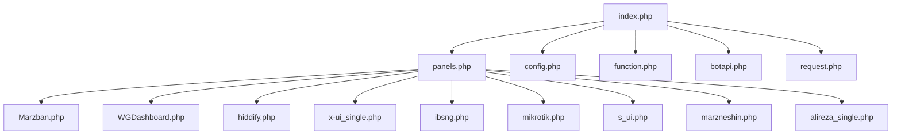

**Diagram sources**
- [index.php:1-200](file://index.php#L1-L200)
- [panels.php:1-200](file://panels.php#L1-L200)
- [Marzban.php:1-200](file://Marzban.php#L1-L200)
- [WGDashboard.php:1-200](file://WGDashboard.php#L1-L200)
- [hiddify.php:1-200](file://hiddify.php#L1-L200)
- [x-ui_single.php:1-200](file://x-ui_single.php#L1-L200)
- [ibsng.php:1-200](file://ibsng.php#L1-L200)
- [mikrotik.php:1-200](file://mikrotik.php#L1-L200)
- [s_ui.php:1-200](file://s_ui.php#L1-L200)
- [marzneshin.php:1-200](file://marzneshin.php#L1-L200)
- [alireza_single.php:1-200](file://alireza_single.php#L1-L200)
- [config.php:1-200](file://config.php#L1-L200)
- [function.php:1-200](file://function.php#L1-L200)
- [botapi.php:1-200](file://botapi.php#L1-L200)
- [request.php:1-200](file://request.php#L1-L200)

**Section sources**
- [index.php:1-200](file://index.php#L1-L200)
- [panels.php:1-200](file://panels.php#L1-L200)
- [config.php:1-200](file://config.php#L1-L200)
- [function.php:1-200](file://function.php#L1-L200)
- [botapi.php:1-200](file://botapi.php#L1-L200)
- [request.php:1-200](file://request.php#L1-L200)

## Core Components
The integration system revolves around a small set of core components:

- Configuration loader: Provides base URLs, credentials, and feature flags for each panel.
- Request dispatcher: Routes calls to the correct panel module and normalizes responses.
- Panel modules: Implement the standardized interface for each supported platform.
- Utilities: Shared helpers for HTTP requests, logging, error mapping, and rate limiting.

Key responsibilities:
- Authentication: Each panel module handles its own auth strategy (token-based, session cookies, or SSH).
- Service provisioning: Create, update, suspend, resume, and delete services consistently.
- User management: List users, update quotas, reset traffic counters, and manage expiration.
- Traffic monitoring: Aggregate usage metrics and expose normalized statistics.

Implementation patterns:
- Standardized function signatures across modules for create/update/delete/list/status.
- Centralized error mapping to common error codes/messages.
- Optional connection pooling via persistent cURL handles or shared sessions.
- Rate limiting hooks per panel with configurable backoff.

**Section sources**
- [config.php:1-200](file://config.php#L1-L200)
- [function.php:1-200](file://function.php#L1-L200)
- [botapi.php:1-200](file://botapi.php#L1-L200)
- [request.php:1-200](file://request.php#L1-L200)

## Architecture Overview
The system follows a plugin architecture where the dispatcher selects a panel implementation at runtime based on configuration. All integrations adhere to a common contract so higher-level logic remains agnostic of the underlying platform.

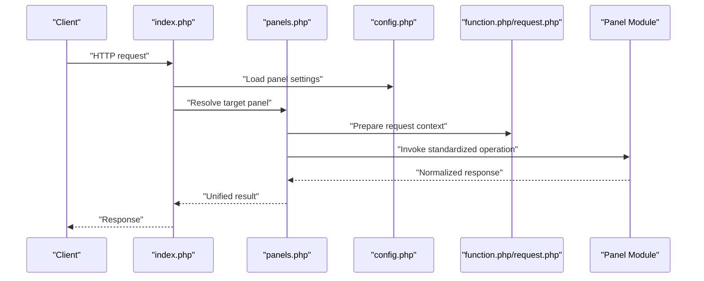

**Diagram sources**
- [index.php:1-200](file://index.php#L1-L200)
- [panels.php:1-200](file://panels.php#L1-L200)
- [config.php:1-200](file://config.php#L1-L200)
- [function.php:1-200](file://function.php#L1-L200)
- [request.php:1-200](file://request.php#L1-L200)

## Detailed Component Analysis

### Marzban Integration
- Authentication: Typically token-based; module manages header injection and token refresh if required.
- Service provisioning: Create/modify/delete inbounds and subscriptions; normalize payload to Marzban API schema.
- User management: Update quotas, expiration, and status; map errors to standard codes.
- Traffic monitoring: Fetch usage stats and aggregate into normalized format.

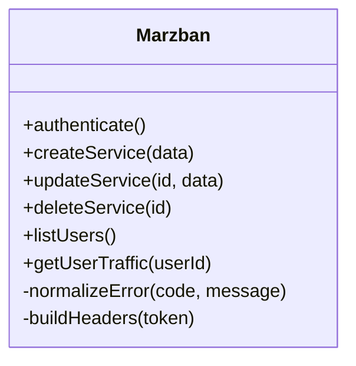

**Diagram sources**
- [Marzban.php:1-200](file://Marzban.php#L1-L200)

**Section sources**
- [Marzban.php:1-200](file://Marzban.php#L1-L200)

### WGDashboard Integration
- Authentication: Uses dashboard API keys or session tokens depending on configuration.
- Service provisioning: Manages WireGuard peers and configurations; maps peer lifecycle to standardized operations.
- User management: Updates peer attributes like allowed IPs, endpoints, and traffic limits.
- Traffic monitoring: Reads peer traffic counters and converts to unified units.

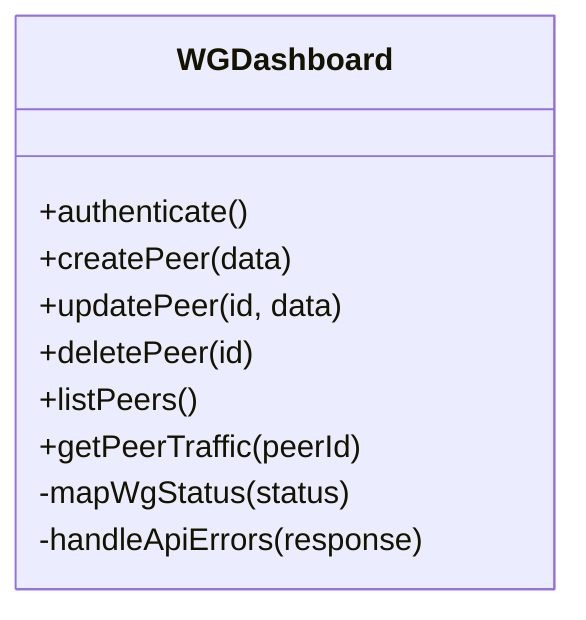

**Diagram sources**
- [WGDashboard.php:1-200](file://WGDashboard.php#L1-L200)

**Section sources**
- [WGDashboard.php:1-200](file://WGDashboard.php#L1-L200)

### Hiddify Integration
- Authentication: Token or session-based; module ensures headers are attached to every request.
- Service provisioning: Creates and updates Hiddify-compatible services; validates payloads before sending.
- User management: Adjusts quotas and expiration; synchronizes state with panel.
- Traffic monitoring: Retrieves usage metrics and normalizes them.

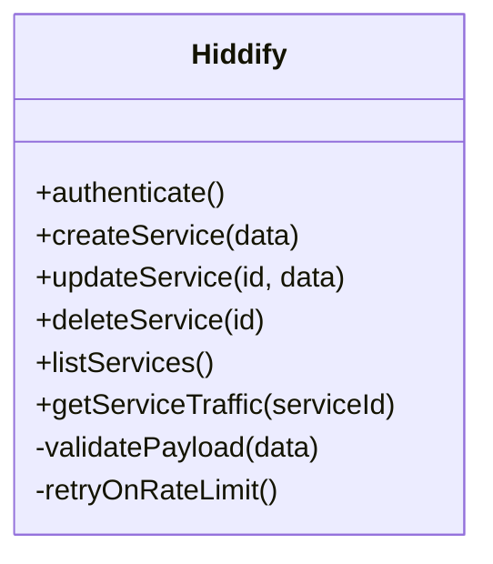

**Diagram sources**
- [hiddify.php:1-200](file://hiddify.php#L1-L200)

**Section sources**
- [hiddify.php:1-200](file://hiddify.php#L1-L200)

### X-UI Integration
- Authentication: Session cookie management; module logs in once and reuses session.
- Service provisioning: Manages inbounds and clients; translates operations to X-UI API calls.
- User management: Updates client quotas, links, and status; handles validation errors.
- Traffic monitoring: Aggregates client traffic and returns normalized values.

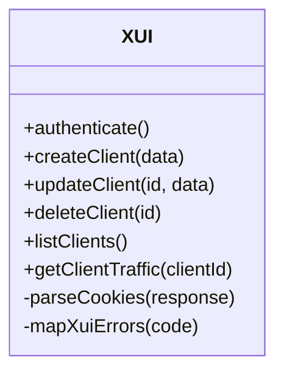

**Diagram sources**
- [x-ui_single.php:1-200](file://x-ui_single.php#L1-L200)

**Section sources**
- [x-ui_single.php:1-200](file://x-ui_single.php#L1-L200)

### IBSng Integration
- Authentication: Uses IBSng API credentials; module constructs signed requests as required.
- Service provisioning: Creates and modifies firewall rules and user accounts; maps to IBSng entities.
- User management: Updates quotas and expiration; syncs account states.
- Traffic monitoring: Pulls accounting data and normalizes counters.

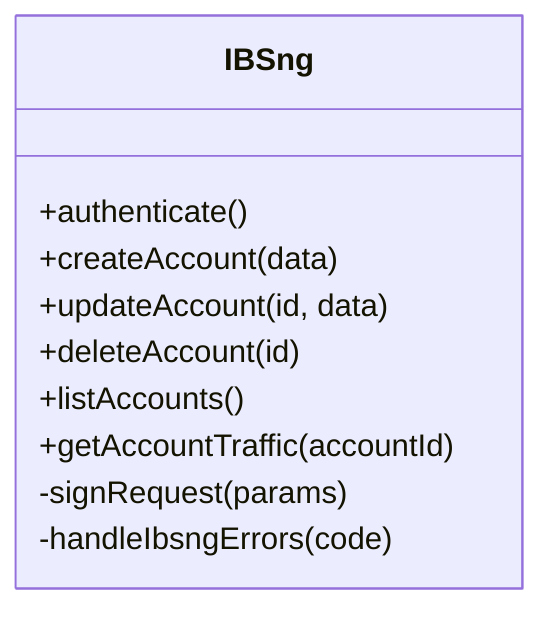

**Diagram sources**
- [ibsng.php:1-200](file://ibsng.php#L1-L200)

**Section sources**
- [ibsng.php:1-200](file://ibsng.php#L1-L200)

### Mikrotik Integration
- Authentication: SSH-based; module establishes persistent connections and executes commands.
- Service provisioning: Manages PPP profiles, addresses, and NAT rules; wraps CLI commands in safe abstractions.
- User management: Updates user properties and quotas; parses command outputs reliably.
- Traffic monitoring: Queries interfaces and user stats; aggregates into normalized metrics.

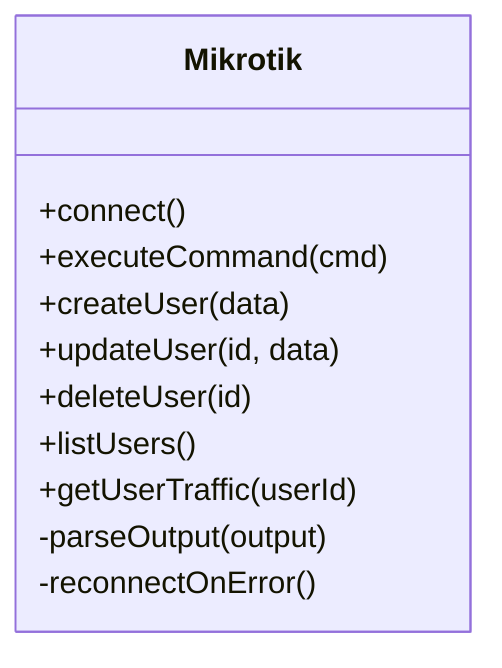

**Diagram sources**
- [mikrotik.php:1-200](file://mikrotik.php#L1-L200)

**Section sources**
- [mikrotik.php:1-200](file://mikrotik.php#L1-L200)

### S-UI Integration
- Authentication: Token or session-based; module maintains active sessions and refreshes tokens when needed.
- Service provisioning: Creates and updates services; validates inputs against S-UI schema.
- User management: Adjusts quotas and expiration; synchronizes user states.
- Traffic monitoring: Retrieves usage data and normalizes it.

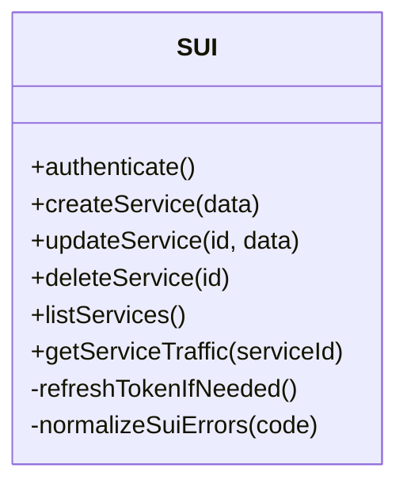

**Diagram sources**
- [s_ui.php:1-200](file://s_ui.php#L1-L200)

**Section sources**
- [s_ui.php:1-200](file://s_ui.php#L1-L200)

### Marzneshin Integration
- Authentication: API key or token; module attaches credentials to requests securely.
- Service provisioning: Manages services and subscriptions; maps operations to Marzneshin API.
- User management: Updates quotas and expiration; handles validation and conflict resolution.
- Traffic monitoring: Collects usage metrics and returns normalized results.

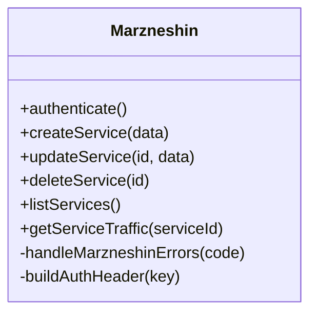

**Diagram sources**
- [marzneshin.php:1-200](file://marzneshin.php#L1-L200)

**Section sources**
- [marzneshin.php:1-200](file://marzneshin.php#L1-L200)

### Alireza Integration
- Authentication: Platform-specific credentials; module manages login and session persistence.
- Service provisioning: Creates and updates services; adapts payloads to Alireza requirements.
- User management: Updates quotas and expiration; synchronizes user states.
- Traffic monitoring: Retrieves usage data and normalizes counters.

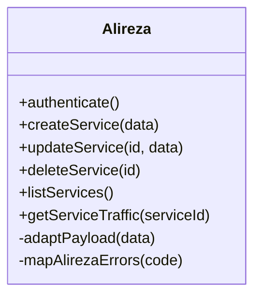

**Diagram sources**
- [alireza_single.php:1-200](file://alireza_single.php#L1-L200)

**Section sources**
- [alireza_single.php:1-200](file://alireza_single.php#L1-L200)

### Standardized Interface Pattern
All panel modules implement a consistent set of operations:

- authenticate(): Establishes session or token for subsequent calls.
- create*(data): Provision a new service/user/peer with validated input.
- update*(id, data): Modify existing entity fields safely.
- delete*(id): Remove entity with idempotent behavior.
- list*(): Retrieve collections with pagination support.
- get*Traffic(identifier): Return normalized traffic metrics.

Common behaviors:
- Error mapping: Convert platform-specific errors to unified codes/messages.
- Validation: Enforce input constraints before making external calls.
- Retry/backoff: Handle transient failures and rate limits gracefully.
- Logging: Record request/response summaries for debugging.

**Section sources**
- [Marzban.php:1-200](file://Marzban.php#L1-L200)
- [WGDashboard.php:1-200](file://WGDashboard.php#L1-L200)
- [hiddify.php:1-200](file://hiddify.php#L1-L200)
- [x-ui_single.php:1-200](file://x-ui_single.php#L1-L200)
- [ibsng.php:1-200](file://ibsng.php#L1-L200)
- [mikrotik.php:1-200](file://mikrotik.php#L1-L200)
- [s_ui.php:1-200](file://s_ui.php#L1-L200)
- [marzneshin.php:1-200](file://marzneshin.php#L1-L200)
- [alireza_single.php:1-200](file://alireza_single.php#L1-L200)

### Custom Panel Integration Example
To add a new panel integration:

- Create a new module file under the root directory following the naming convention.
- Implement the standardized methods: authenticate, create*, update*, delete*, list*, get*Traffic.
- Use shared utilities for HTTP requests, logging, and error mapping.
- Register the panel in the dispatcher so it can be resolved by configuration.
- Add configuration entries for base URL, credentials, and feature flags.

Reference paths for patterns:
- [Marzban.php:1-200](file://Marzban.php#L1-L200)
- [WGDashboard.php:1-200](file://WGDashboard.php#L1-L200)
- [hiddify.php:1-200](file://hiddify.php#L1-L200)
- [x-ui_single.php:1-200](file://x-ui_single.php#L1-L200)
- [ibsng.php:1-200](file://ibsng.php#L1-L200)
- [mikrotik.php:1-200](file://mikrotik.php#L1-L200)
- [s_ui.php:1-200](file://s_ui.php#L1-L200)
- [marzneshin.php:1-200](file://marzneshin.php#L1-L200)
- [alireza_single.php:1-200](file://alireza_single.php#L1-L200)

**Section sources**
- [Marzban.php:1-200](file://Marzban.php#L1-L200)
- [WGDashboard.php:1-200](file://WGDashboard.php#L1-L200)
- [hiddify.php:1-200](file://hiddify.php#L1-L200)
- [x-ui_single.php:1-200](file://x-ui_single.php#L1-L200)
- [ibsng.php:1-200](file://ibsng.php#L1-L200)
- [mikrotik.php:1-200](file://mikrotik.php#L1-L200)
- [s_ui.php:1-200](file://s_ui.php#L1-L200)
- [marzneshin.php:1-200](file://marzneshin.php#L1-L200)
- [alireza_single.php:1-200](file://alireza_single.php#L1-L200)

## Dependency Analysis
The dispatcher depends on configuration and utilities, while each panel module depends only on shared helpers. This decoupling allows easy addition of new panels without modifying core logic.

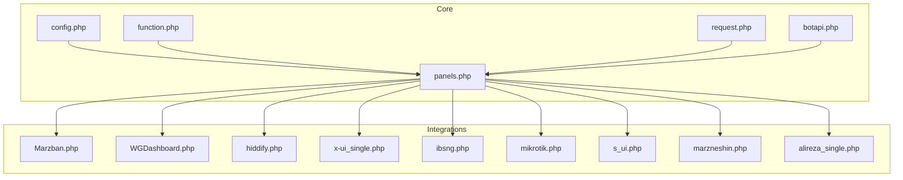

**Diagram sources**
- [config.php:1-200](file://config.php#L1-L200)
- [function.php:1-200](file://function.php#L1-L200)
- [request.php:1-200](file://request.php#L1-L200)
- [botapi.php:1-200](file://botapi.php#L1-L200)
- [panels.php:1-200](file://panels.php#L1-L200)
- [Marzban.php:1-200](file://Marzban.php#L1-L200)
- [WGDashboard.php:1-200](file://WGDashboard.php#L1-L200)
- [hiddify.php:1-200](file://hiddify.php#L1-L200)
- [x-ui_single.php:1-200](file://x-ui_single.php#L1-L200)
- [ibsng.php:1-200](file://ibsng.php#L1-L200)
- [mikrotik.php:1-200](file://mikrotik.php#L1-L200)
- [s_ui.php:1-200](file://s_ui.php#L1-L200)
- [marzneshin.php:1-200](file://marzneshin.php#L1-L200)
- [alireza_single.php:1-200](file://alireza_single.php#L1-L200)

**Section sources**
- [panels.php:1-200](file://panels.php#L1-L200)
- [config.php:1-200](file://config.php#L1-L200)
- [function.php:1-200](file://function.php#L1-L200)
- [request.php:1-200](file://request.php#L1-L200)
- [botapi.php:1-200](file://botapi.php#L1-L200)

## Performance Considerations
- Connection pooling: Reuse HTTP sessions or SSH connections to reduce overhead.
- Rate limiting: Implement exponential backoff and jitter for retries; respect panel-specific limits.
- Batch operations: Where possible, batch user updates or traffic queries to minimize round trips.
- Caching: Cache static panel metadata (e.g., available features) to avoid repeated lookups.
- Timeouts and retries: Configure sensible timeouts and retry policies per panel to handle transient network issues.

[No sources needed since this section provides general guidance]

## Troubleshooting Guide
Common issues and resolutions:
- Authentication failures: Verify credentials, token expiry, and session validity; check panel logs for denied access.
- Rate limit errors: Increase backoff intervals; throttle requests; consider batching.
- Network timeouts: Inspect connectivity, DNS resolution, and firewall rules; adjust timeouts accordingly.
- Payload validation errors: Ensure inputs match panel schemas; log raw payloads for diagnostics.
- Inconsistent traffic metrics: Normalize units and reconcile counters; verify panel API versions.

Operational checks:
- Health endpoint pings to confirm panel reachability.
- Auth handshake tests during startup or periodic maintenance.
- Error code mapping verification to ensure consistent reporting.

**Section sources**
- [Marzban.php:1-200](file://Marzban.php#L1-L200)
- [WGDashboard.php:1-200](file://WGDashboard.php#L1-L200)
- [hiddify.php:1-200](file://hiddify.php#L1-L200)
- [x-ui_single.php:1-200](file://x-ui_single.php#L1-L200)
- [ibsng.php:1-200](file://ibsng.php#L1-L200)
- [mikrotik.php:1-200](file://mikrotik.php#L1-L200)
- [s_ui.php:1-200](file://s_ui.php#L1-L200)
- [marzneshin.php:1-200](file://marzneshin.php#L1-L200)
- [alireza_single.php:1-200](file://alireza_single.php#L1-L200)

## Conclusion
The VPN panel integration system provides a robust, extensible framework for managing diverse VPN platforms through a unified interface. By adhering to a standardized contract and leveraging shared utilities, the system simplifies operations such as authentication, provisioning, user management, and traffic monitoring. The modular design encourages easy addition of new panels while maintaining consistency and reliability across integrations.

[No sources needed since this section summarizes without analyzing specific files]

## Appendices

### Implementation Checklist for New Panels
- Define authentication strategy and implement authenticate().
- Implement create*, update*, delete*, list*, and get*Traffic() methods.
- Map panel-specific errors to unified codes/messages.
- Add configuration entries for base URL, credentials, and feature flags.
- Register the panel in the dispatcher for resolution.
- Test with sample payloads and edge cases; validate traffic normalization.

Reference paths:
- [Marzban.php:1-200](file://Marzban.php#L1-L200)
- [WGDashboard.php:1-200](file://WGDashboard.php#L1-L200)
- [hiddify.php:1-200](file://hiddify.php#L1-L200)
- [x-ui_single.php:1-200](file://x-ui_single.php#L1-L200)
- [ibsng.php:1-200](file://ibsng.php#L1-L200)
- [mikrotik.php:1-200](file://mikrotik.php#L1-L200)
- [s_ui.php:1-200](file://s_ui.php#L1-L200)
- [marzneshin.php:1-200](file://marzneshin.php#L1-L200)
- [alireza_single.php:1-200](file://alireza_single.php#L1-L200)